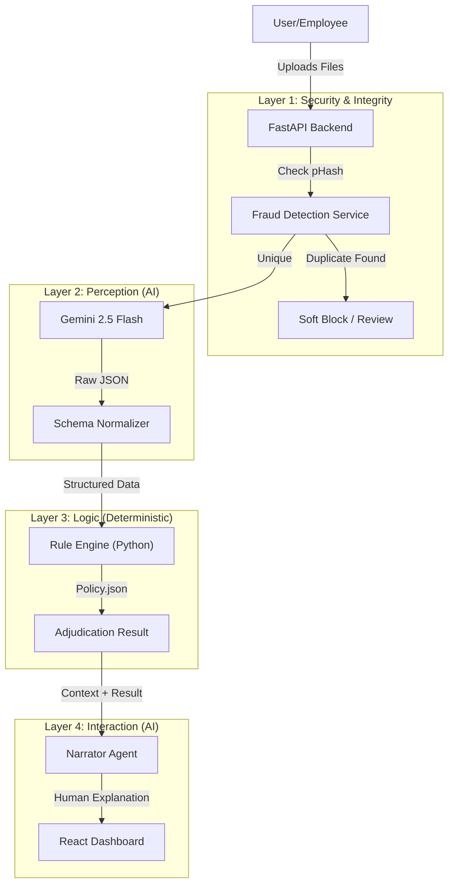
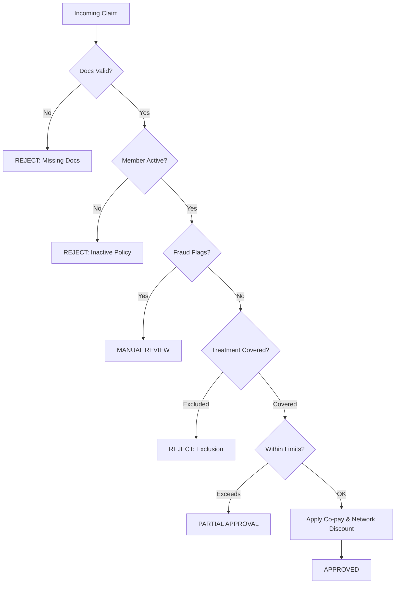

# Plum Claims AI: Intelligent OPD Adjudication Engine

This is a full-stack web application designed to automate the adjudication of Outpatient Department (OPD) insurance claims. It acts as an intelligent auditing layer that combines the perception capabilities of Large Language Models (LLMs) with the reliability of deterministic rule engines.

The system goes beyond simple data extraction; it implements a neuro-symbolic architecture to detect fraud, enforce complex policy logic, and provide transparent, explainable decisions to both claimants and administrators.

**Live Application:** [https://plum-claims-frontend.onrender.com/](https://plum-claims-frontend.onrender.com/)

## 1\. Project Setup & Demo

The project is structured as a monorepo. It is fully containerized for reproducibility.

### Backend Setup

1.  Navigate to the `backend` directory.
2.  Create a virtual environment and activate it.
3.  Install dependencies:
    ```bash
    pip install -r requirements.txt
    ```
4.  Set up your environment variables (create a `.env` file):
    ```env
    GEMINI_API_KEY=your_google_api_key
    ```
5.  Start the server:
    ```bash
     uvicorn app.main:app --reload --port 8000             
    ```
    The backend will run at `http://localhost:8000`.

### Frontend Setup

1.  Navigate to the `frontend` directory.
2.  Install dependencies:
    ```bash
    npm install
    ```
3.  Start the development server:
    ```bash
    npm run dev
    ```
    The frontend will run at `http://localhost:5173`.

### Docker Setup (Recommended)

To run the entire stack with a single command:

```bash
docker-compose up --build
```

## 2\. AI Architecture Deep Dive: Engineering a Neuro-Symbolic System

Many AI wrappers simply pass user input to an LLM and display the output. For a domain as regulated as Insurance, this "black box" approach is unacceptable due to the risk of hallucinations and financial error.

My goal was to engineer a system that is auditable, consistent, and explainable. To achieve this, I designed a pipeline that decouples **Perception** (reading the document) from **Reasoning** (making the decision).

Here is a breakdown of the architectural decisions that elevate this system beyond a simple API wrapper:

### A. Neuro-Symbolic Logic Integration

LLMs are excellent at understanding unstructured text but unreliable at arithmetic and strict boolean logic. To solve this, I implemented a hybrid architecture:

  * **The Neural Layer (Gemini 2.5 Flash):** Responsible strictly for extraction and normalization. It reads noisy OCR text, interprets handwritten prescriptions, and maps non-standard terms (e.g., "Teeth Whitening") to standardized policy categories (e.g., "Dental - Cosmetic").
  * **The Symbolic Layer (Python Rule Engine):** Responsible for adjudication. Once the data is structured, a deterministic Python engine enforces the policy limits. It calculates co-pays, checks sub-limits, and applies exclusions. This ensures that financial decisions are 100% mathematically accurate and traceable.

### B. Security & Integrity: Pre-Computation Fraud Detection
Sending every image to an LLM is expensive and inefficient. A robust system must reject obvious duplicates before they incur processing costs.

* **Implementation:** I implemented **Cryptographic Hashing (SHA-256)** to generate unique digital fingerprints for every uploaded file.
* **Why it is superior for Documents:** While Perceptual Hashing (pHash) is good for natural images, it is often *too* aggressive for documents, falsely flagging distinct bills as duplicates simply because they share a hospital letterhead or layout. 
* **The Result:** SHA-256 provides a deterministic "Hard Block" against exact file re-uploads and spam, ensuring that the system never processes the exact same file twice, while correctly allowing distinct bills that share similar visual templates to pass through to the AI layer.

### C. Contextual Multi-Document Reasoning

A medical claim is rarely a single document; it is a story told across bills, prescriptions, and lab reports. A naive system processes files individually, missing the context.

  * **Implementation:** The backend aggregates all uploaded files into a single inference context. This allows the system to cross-reference validation rules, such as ensuring a billed medication appears on the accompanying prescription.
  * **Medical Context Injection:** The extraction layer is explicitly instructed to identify diagnostic values from lab reports. This data is then fed into a secondary "Narrator" agent, which generates a patient-centric explanation of the medical condition, transforming the app from a financial tool into a wellness partner.

### D. The "Narrator" Agent for Explainability

Raw database logs (e.g., `REJECT_REASON: LIMIT_EXCEEDED`) are hostile to users.

  * **Solution:** I engineered a dedicated "Narrator" agent. It takes the raw mathematical ledger generated by the Rule Engine and synthesizes it into a human-readable summary.
  * **Result:** Instead of generic errors, the user sees: *"Your claim was approved, but we deducted ₹500 because your policy has a 10% co-pay on consultations."* This bridges the gap between system logic and user understanding.

## 3\. System Architecture & Diagrams

The system follows a service-oriented design where the API acts as an orchestrator between the Interface, the Intelligence Layer, and the Persistence Layer.

### High-Level Architecture



### Decision Logic Flowchart

The adjudication process follows a strict "Fail-Fast" waterfall model to ensure compliance.



## 4\. API Documentation

### `POST /v1/claims/upload`

The primary endpoint for processing claims. It handles file ingestion, runs the full AI pipeline, and returns the adjudication decision.

  * **Request:** `multipart/form-data`
      * `files`: Array of file objects (Images/PDFs).
      * `member_id`: (Optional) String to override member identification.
  * **Response:** JSON object containing the decision, approved amount, confidence score, detailed financial breakdown, and narrative explanation.

### `GET /v1/claims/pending`

Retrieves the queue of claims flagged for Manual Review. Used by the Admin Console.

### `PUT /v1/claims/{claim_id}`

Allows an administrator to override the AI decision.

  * **Payload:** JSON object containing the new status (`APPROVED`/`REJECTED`), updated amount, and override reason.

## 5\. Assumptions & Trade-offs

  * **Authentication (Simulated):**

      * *Decision:* Implemented a client-side "Persona Switcher" using `localStorage` to manage User/Admin sessions.
      * *Reasoning:* This demonstrates Role-Based Access Control (RBAC) logic—such as the Admin Override interface—without the overhead of setting up a full OAuth2 provider for the MVP.
      * *Production Path:* In a real deployment, this would be replaced by an OIDC middleware integrating with Auth0 or AWS Cognito.

  * **Database (SQLite):**

      * *Decision:* Used SQLite for zero-config persistence and portability.
      * *Implication:* On serverless platforms with ephemeral storage (like Render Free Tier), data resets on redeployment.
      * *Production Path:* Migration to a managed PostgreSQL instance to handle concurrent writes and ensure data durability.

## 6\. Future Roadmap & Architecture Evolution

While this MVP demonstrates a functional neuro-symbolic pipeline, a production-scale deployment would require advancements in both AI model architecture and system design to handle scale, cost, and security.

### AI Research & Model Optimization

* **Self-Hosted Fine-Tuned VLM (Privacy & Cost Efficiency)**
    * **Current State:** The system relies on external APIs (Gemini 2.5 Flash), creating dependencies on third-party latency and per-token pricing.
    * **Future State:** Distill the knowledge from the large foundation model into a smaller, open-source Vision Language Model (e.g., **PaliGemma 3B** or **LLaVA-Next**). Fine-tuning this model specifically on a dataset of medical invoices would allow for fully on-premise deployment, ensuring 100% data privacy and eliminating variable API costs.

* **Visual Forensics with Deep Learning**
    * **Current State:** Utilizes Perceptual Hashing (pHash) for exact duplicate detection.
    * **Future State:** Train a dedicated **Convolutional Neural Network (CNN)** or **Autoencoder** on a dataset of digitally manipulated documents. This model would detect subtle forensic anomalies—such as mismatched fonts, pixel grid inconsistencies, or metadata tampering—that standard hashing algorithms cannot identify.

* **Predictive Risk Modeling (Tabular Learning)**
    * **Future State:** Implement a "Fast Track" adjudication lane using a gradient-boosting model (**XGBoost** or **TabNet**). Trained on historical claims data, this model would predict the probability of a claim being fraudulent or rejected before it reaches the extraction layer. High-confidence approvals could be fast-tracked to optimize compute resources.

### System Engineering & Scalability

* **Dynamic Policy Engine (RAG)**
    * **Current State:** Adjudication rules are loaded from a static `policy_terms.json` file.
    * **Future State:** Ingest thousands of corporate policy documents into a Vector Database (**Pinecone**). At runtime, the system would use **Retrieval Augmented Generation (RAG)** to dynamically fetch the specific coverage clauses and sub-limits relevant to the user's specific plan ID, enabling multi-tenant support.

* **Graph-Based Fraud Detection**
    * **Future State:** Implement **Graph Neural Networks (GNN)** to model relationships between entities. This would detect organized fraud rings by identifying non-obvious patterns, such as multiple unrelated employees uploading bills generated from the same device fingerprint or referencing the same doctor ID across geographically impossible locations.
